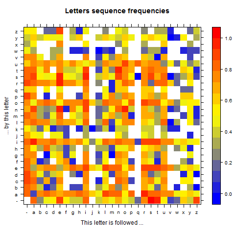

---
title       : Word Generator
subtitle    : 2016, June 24th
author      : Gregory Vial
framework   : io2012        # {io2012, html5slides, shower, dzslides, ...}
highlighter : highlight.js  # {highlight.js, prettify, highlight}
hitheme     : tomorrow      # 
widgets     : [bootstrap, quiz]            # {mathjax, quiz, bootstrap}
mode        : selfcontained # {standalone, draft}

--- 

## What does this product do?

### Product description
This product generates french and russian look-alike words.

### Product features
You can choose from various options:

1. Language: french or russian
2. Minimum and maximum length of the word to be generated
3. Number of words to be generated

### Using this product
The simplest way is to access this application online on the <a href="https://gregv.shinyapps.io/WordGenerator/"> shiny server</a>. Please note that the application might not be up at all time due to limited available server time.

Alternatively you can run it on your own machine. See last slide for details.

--- 

## How does this product work?

The application reads from a large corpus of french and russian words.
For each word the sequence of 2 and 3 letters are observed and their frequencies are recorded in a array. The chart below represents the frequencies of 2 letters sequences (french).

<center>

</center>

The product then uses a markov chain to generate a new sequence of letters that will ressemble that of regular french or russian words. From time to time an existing word will be generated.


--- 

## Encoding
We present below the code of the functions that convert character to ASCII and vice versa

```{r eval=FALSE}
asc <- function(x) { strtoi(charToRaw(x),16L) }
chr <- function(n) { rawToChar(as.raw(n)) }
```

In addition one of the challenge whilst developing this project was to get french accentuated letters as well as cyrillic to display correctly on any device.
This was resolved by this simple piece of code.

```{r eval=FALSE}
## French
Encoding(res) <- "latin1"
Sys.setlocale("LC_CTYPE", "french")
## Russian
Sys.setlocale("LC_CTYPE", "russian")

```

--- 

## More resources

### Links
Shiny application available at https://gregv.shinyapps.io/WordGenerator/

Github repo with all sources available at https://github.com/GregVial/WordGenerator

Original idea for this product by David Louapre sciencetonnante@gmail.com

### Running this product on your machine
Download from  <a href="https://github.com/GregVial/WordGenerator">GitHub</a> the files "WordGenerator.R" and "WordGeneratorPreProcessing.R" on your device and update the code: line 10 of each file set workding directory to your own working directory

Run "WordGeneratorPreProcessing.R" only once, it will create the probability array. Allow for some time to complete as it will have to process 330k+ entries (french) and 130k+ entries (russian).

Then run "WordGenerator.R" as many times as you want to generate words.
